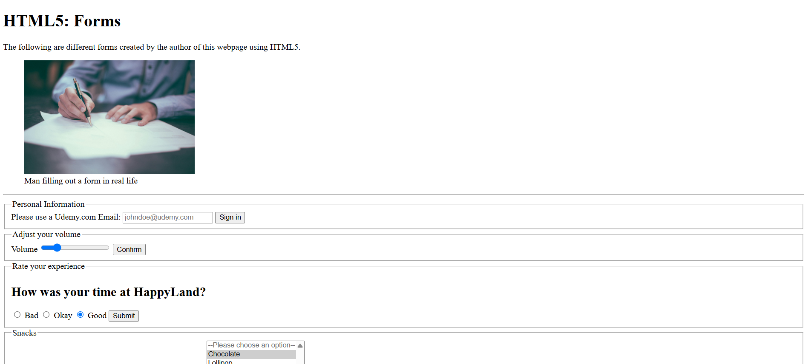

# HTML5 Forms

## A Basic Interactive Webpage using HTML5 Form Elements

A pure HTML project built to showcase various types of form inputs, validations, and semantic structure using only HTML5.

---

## Overview

This project contains multiple form examples designed to demonstrate key form elements in HTML5.

Each form is wired to a testing endpoint (`https://httpbin.org/get`) to simulate data submission and response behavior in real-world form handling.

---

## Features

- Email input validation
- Range sliders
- Radio buttons and grouped choices
- Multiple selection dropdowns
- Semantic grouping with `<fieldset>` and `<legend>`

---

## What I Learned

- How to build and structure HTML forms for different use cases
- Validating input types using attributes like `pattern`, `required`, and `placeholder`
- Grouping related form fields with `<fieldset>` and `<legend>`
- Using `<select>` with `multiple` and `size` attributes
- Accessibility and usability of form labels and controls
- How `form` attributes work with HTTP GET methods and external targets

---

## Tech Used

- HTML5
- Git
- GitHub
- Netlify

---

## How to Run

1. Clone the repository
2. Open `index.html` in your browser
3. Submit any form and results will open in a new tab via **[httpbin.org](https://httpbin.org)**

---

## Live Demo

Or you can check out the **[live website here](https://html5-forms-jiro.netlify.app/)**

---

## Author

Created by **Elmar Chavez**

Month/Year: **April 2025**

Journey: **1st** month of learning _frontend web development_.
